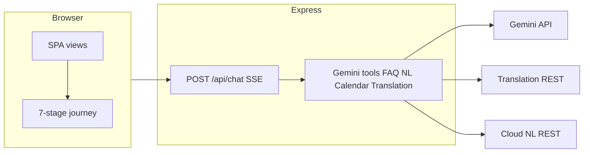

# Civitra

**Civic + Mitra** — Clarity in every vote. An AI-powered, non-partisan assistant for **Indian election process education**, with a guided seven-stage journey, Gemini tool orchestration, and production-style quality gates.

## Architecture

| Layer    | Technology                                                                                                                                                                                                                             |
| -------- | -------------------------------------------------------------------------------------------------------------------------------------------------------------------------------------------------------------------------------------- |
| Frontend | Semantic HTML, CSS, vanilla ES modules (`public/js/`)                                                                                                                                                                                  |
| Backend  | Node.js 22, Express, SSE streaming chat                                                                                                                                                                                                |
| AI       | Google **Gemini** (`@google/genai`) with **function calling** to 8 tools inc. **Vertex-style semantic FAQ search** via `text-embedding-004`, safety settings (`BLOCK_MEDIUM_AND_ABOVE` all categories), and per-request token tracking |
| Data     | 55+ curated FAQ items with **embedding-cached cosine search** (`src/data/faq-corpus.json`), knowledge base, optional **Firestore**                                                                                                     |
| Maps     | Google Maps JavaScript API (client) via `/api/booth/maps-key`                                                                                                                                                                          |
| Auth     | Email/password + JWT + optional Firebase (see `src/api/auth.js`)                                                                                                                                                                       |



## Google Cloud and APIs used

| Service                        | Role in Civitra                                                                                                                                                                                                                               |
| ------------------------------ | --------------------------------------------------------------------------------------------------------------------------------------------------------------------------------------------------------------------------------------------- |
| **Gemini API**                 | Chat + tool routing (`lookup_semantic_faq`, `lookup_election_faq`, `translate_text`, `get_election_timeline`, `create_calendar_reminder_link`, `analyze_voter_query`, `check_voter_eligibility`) + `text-embedding-004` for FAQ vector search |
| **Cloud Translation API**      | Optional `translate_text` tool when `TRANSLATION_API_KEY` is set                                                                                                                                                                              |
| **Cloud Natural Language API** | Optional entity hints via `analyze_voter_query` when `NATURAL_LANGUAGE_API_KEY` is set                                                                                                                                                        |
| **Google Calendar**            | Deep-link template URLs (no OAuth)                                                                                                                                                                                                            |
| **Maps JavaScript / Places**   | Booth discovery UI when `MAPS_API_KEY` is set                                                                                                                                                                                                 |
| **Firestore**                  | Optional persistence for authenticated users                                                                                                                                                                                                  |
| **Cloud Run**                  | Container deployment (`Dockerfile`, port **8080**)                                                                                                                                                                                            |
| **Cloud Build**                | Optional CI/CD (`cloudbuild.yaml`)                                                                                                                                                                                                            |

### Graceful degradation

Every optional GCP service shows a **visible fallback** when its key is absent:

| Service                  | Fallback behaviour                                                                                      |
| ------------------------ | ------------------------------------------------------------------------------------------------------- |
| **Maps API**             | Booth view shows a styled banner linking to [ECI Electoral Search](https://electoralsearch.eci.gov.in/) |
| **Translation API**      | Language picker shows "Translation unavailable — showing English" banner                                |
| **Natural Language API** | Silently returns empty entities; analytics-only, no user-facing impact                                  |
| **Gemini API**           | Chat returns explicit error message asking user to configure the key                                    |
| **Firestore**            | In-memory session storage used instead; chat still works                                                |

FAQ corpus, election timeline, calendar links, and eligibility checks always work offline with no external dependencies.

## Local setup

1. **Node.js 22+**
2. `npm ci`
3. Copy [`.env.example`](.env.example) to `.env` and set at least `GEMINI_API_KEY`.
4. `npm run dev` — app at `http://localhost:3000` (or `PORT`).

## Scripts

| Script                  | Purpose                                                  |
| ----------------------- | -------------------------------------------------------- |
| `npm run dev`           | Watch mode server                                        |
| `npm start`             | Production server                                        |
| `npm run lint`          | ESLint                                                   |
| `npm run format`        | Prettier write                                           |
| `npm run typecheck`     | `tsc --noEmit` (JS check mode)                           |
| `npm run test`          | Vitest unit + integration                                |
| `npm run test:coverage` | Vitest with coverage thresholds                          |
| `npm run test:e2e`      | Playwright + axe (starts server on `3333`)               |
| `npm run validate`      | typecheck + lint + format check + unit/integration tests |
| `npm run validate:ci`   | Same with coverage (used in GitHub Actions)              |

## Deployment (Cloud Run)

```bash
gcloud builds submit --config cloudbuild.yaml
```

Configure **Secret Manager** (or Cloud Run environment variables) for `GEMINI_API_KEY`, `MAPS_API_KEY`, `TRANSLATION_API_KEY`, `NATURAL_LANGUAGE_API_KEY`, `JWT_SECRET`, and Firebase credentials as required. Never commit secrets. See [SECURITY.md](SECURITY.md).

## Prompt / build journey (hackathon)

1. Architected a **seven-stage journey** bar that reuses existing views (Eligibility → Registration → Candidates → Voting → Timeline → Polling day → Post-vote).
2. Added **Gemini function calling** with 8 explicit tools and server-side executors mirroring a multi-service civic coach pattern.
3. Implemented **Vertex-style semantic FAQ search** using `text-embedding-004` embeddings with cosine similarity and keyword fallback.
4. Added **i18n language picker** (EN/HI/TA/KN) with Cloud Translation API and visible fallback banner.
5. Enforced **safety_settings** (`BLOCK_MEDIUM_AND_ABOVE`) on all Gemini calls with per-request **token usage tracking**.
6. Enforced **validate** CI: ESLint, Prettier, TypeScript check-js, Vitest coverage floors (60%+), `npm audit`, Playwright + **axe** on all major views.
7. Hardened responses with **CSP**, structured JSON logging, and user-visible degradation banners for each optional GCP service.
8. All development was AI-assisted using iterative prompt-driven gap-closure against the CivikSutra hackathon rubric.

## Demo

> **Live URL**: _(deploy to Cloud Run using `cloudbuild.yaml` or `gcloud run deploy`)_
>
> **Demo video**: _(90-second screen capture: login → chat with tool-grounded answer → switch language → walk the journey → find booth)_
>
> **Screenshots**: Auth view, Chat with tool use, Learn grid, Quiz, Booth map, Manifesto comparison _(capture after deploy)_

## License

MIT
