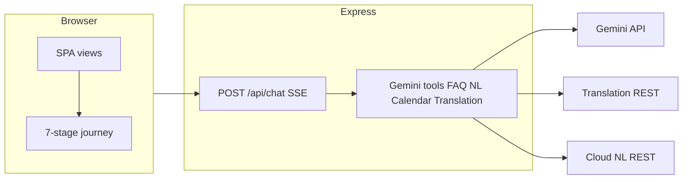

# Civitra

**Civic + Mitra** — Clarity in every vote. An AI-powered, non-partisan assistant for **Indian election process education**, with a guided seven-stage journey, Gemini tool orchestration, and production-style quality gates.

## Architecture

| Layer    | Technology                                                                                                        |
| -------- | ----------------------------------------------------------------------------------------------------------------- |
| Frontend | Semantic HTML, CSS, vanilla ES modules (`public/js/`)                                                             |
| Backend  | Node.js 22, Express, SSE streaming chat                                                                           |
| AI       | Google **Gemini** (`@google/genai`) with **function calling** to FAQ, Translation, NL, Calendar links, timeline   |
| Data     | Curated FAQ corpus (`src/data/faq-corpus.json`), knowledge base string, optional **Firestore** for signed-in chat |
| Maps     | Google Maps JavaScript API (client) via `/api/booth/maps-key`                                                     |
| Auth     | Email/password + JWT + optional Firebase (see `src/api/auth.js`)                                                  |



## Google Cloud and APIs used

| Service                        | Role in Civitra                                                                                                                                                           |
| ------------------------------ | ------------------------------------------------------------------------------------------------------------------------------------------------------------------------- |
| **Gemini API**                 | Chat + tool routing (`lookup_election_faq`, `translate_text`, `get_election_timeline`, `create_calendar_reminder_link`, `analyze_voter_query`, `check_voter_eligibility`) |
| **Cloud Translation API**      | Optional `translate_text` tool when `TRANSLATION_API_KEY` is set                                                                                                          |
| **Cloud Natural Language API** | Optional entity hints via `analyze_voter_query` when `NATURAL_LANGUAGE_API_KEY` is set                                                                                    |
| **Google Calendar**            | Deep-link template URLs (no OAuth)                                                                                                                                        |
| **Maps JavaScript / Places**   | Booth discovery UI when `MAPS_API_KEY` is set                                                                                                                             |
| **Firestore**                  | Optional persistence for authenticated users                                                                                                                              |
| **Cloud Run**                  | Container deployment (`Dockerfile`, port **8080**)                                                                                                                        |
| **Cloud Build**                | Optional CI/CD (`cloudbuild.yaml`)                                                                                                                                        |

Graceful degradation: Translation and NL return safe fallbacks when keys are missing; FAQ and timeline always work locally.

## Local setup

1. **Node.js 22+**
2. `npm ci`
3. Copy [`.env.example`](.env.example) to `.env` and set at least `GEMINI_API_KEY`.
4. `npm run dev` — app at `http://localhost:3000` (or `PORT`).

## Scripts

| Script                  | Purpose                                                  |
| ----------------------- | -------------------------------------------------------- |
| `npm run dev`           | Watch mode server                                        |
| `npm start`             | Production server                                        |
| `npm run lint`          | ESLint                                                   |
| `npm run format`        | Prettier write                                           |
| `npm run typecheck`     | `tsc --noEmit` (JS check mode)                           |
| `npm run test`          | Vitest unit + integration                                |
| `npm run test:coverage` | Vitest with coverage thresholds                          |
| `npm run test:e2e`      | Playwright + axe (starts server on `3333`)               |
| `npm run validate`      | typecheck + lint + format check + unit/integration tests |
| `npm run validate:ci`   | Same with coverage (used in GitHub Actions)              |

## Deployment (Cloud Run)

```bash
gcloud builds submit --config cloudbuild.yaml
```

Configure **Secret Manager** (or Cloud Run environment variables) for `GEMINI_API_KEY`, `MAPS_API_KEY`, `TRANSLATION_API_KEY`, `NATURAL_LANGUAGE_API_KEY`, `JWT_SECRET`, and Firebase credentials as required. Never commit secrets. See [SECURITY.md](SECURITY.md).

## Prompt / build journey (hackathon)

1. Architected a **seven-stage journey** bar that reuses existing views (Chat → Learn → Manifesto → … → Quiz).
2. Added **Gemini function calling** with explicit tools and server-side executors mirroring a multi-service civic coach pattern.
3. Enforced **validate** CI: ESLint, Prettier, TypeScript check-js, Vitest coverage floors, Playwright smoke + **axe** on the auth shell.
4. Hardened responses with **CSP** (defense in depth alongside README guidance for API key restrictions).

## License

MIT
